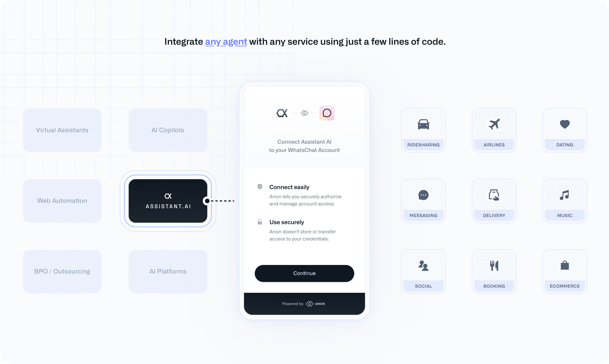

# Welcome to Anon

Add in sample content

<Tip>
  Anon is currently in private beta. To get access to start building on Anon's platform, [click here](https://anondotcom.typeform.com/request-access). 
</Tip>

<Frame>
<iframe
  style="width: 100%; aspect-ratio: 16 / 9;"
  src="https://customer-do2pwi134h6029e3.cloudflarestream.com/dbbff1151e6898a001260af2e832700b/iframe?loop=true&autoplay=true"
  title="Anon Example"
  frameborder="0"
  allow="accelerometer; gyroscope; autoplay; encrypted-media; picture-in-picture;"
  allowfullscreen
></iframe>
</Frame>

Anon enables you to create user-authenticated integrations for websites without APIs and automate user actions that existing APIs don't support.

Anon handles **secure credential collection and validation**, **multi-factor authentication**, **proxying**, and everything else you need to authenticate on behalf of end-users and integrate with supported services.

<Frame>

</Frame>

## Take Action on Behalf of Your Users

Anon allows you to build automation scripts to perform tasks beyond standard API offerings, so you can take action on behalf of your users across various platforms.

### Supported Platforms

- **Social Media**: LinkedIn, Facebook, Instagram
- **Transportation**: Uber, Delta Airlines
- **E-commerce**: Amazon, Instacart
- **Reservations**: OpenTable, Resy

## Start Integrating

<CardGroup cols={2}>
  <Card title="Connecting User Sessions" icon='link' href="/docs/connecting-user-sessions/overview">
    Securely collect and validate end-user credentials.
  </Card>
  <Card title="Running User Sessions" icon='rocket' href="/docs/running-user-sessions/overview">
    Execute actions on behalf of connected user sessions.
  </Card>
</CardGroup>
